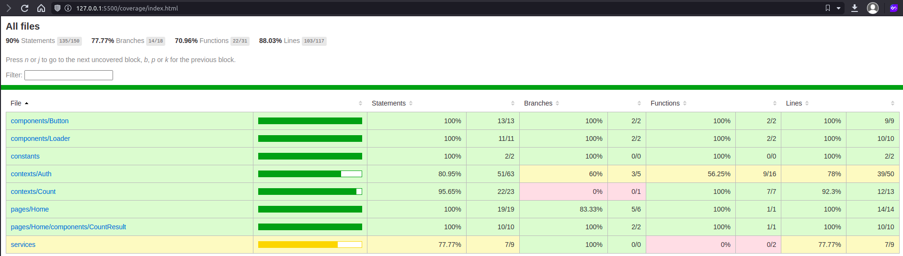

<div align="center">
  <h1>Conexa React Boilerplate</h1>
</div>
<div align="center">
  <a href="https://gitlab.com/conexasaude/boilerplates9/react-boilerplate#conexa-react-boilerplate">
    
    </img>
  </a>
</div>

<br>

<div align="center">
Base project to Conexa's React web apps development
</div>

<br>

# Dependencies 💁

- [Node LTS](https://nodejs.org/en/download/)
- This project uses [Yarn 2](https://yarnpkg.com/) to package management. Please make sure you are using the [latest version](https://yarnpkg.com/getting-started/install).

<br/>

# Important ❗

This project uses `@conexasaude` packages. If you intend to keep it, read the [authentication section](#auth-)

<br>

# IDE & Extensions 🔧

- [Visual Studio Code](https://code.visualstudio.com/)
- [Eslint](https://marketplace.visualstudio.com/items?itemName=dbaeumer.vscode-eslint)
- [Prettier](https://marketplace.visualstudio.com/items?itemName=esbenp.prettier-vscode)
- [EditorConfig](https://marketplace.visualstudio.com/items?itemName=EditorConfig.EditorConfig)

<br>

# Auth 🔑

To use `@conexasaude` packages, you need to authenticate on registry. Follow these steps:

1. Run:

```bash
npm login --scope=@conexasaude --registry=https://npm.pkg.github.com
```

USERNAME = your github user
PASSWORD = is your personal github access token.
EMAIL = your conexa email

To get your access token:

- Access: [Personal access tokens](https://github.com/settings/tokens)
- Click 'Generate new token'
- Name your token
- Select read packages on scopes
- Click 'Generate token'
- Copy the generated token

<br/>

You should now be able to install the packages in your project.

For more information: [Gitlab registry auth documentation](https://docs.gitlab.com/ee/user/packages/npm_registry/#instance-level-npm-endpoint)

<br>

# Deploy - CI/CD 🚀

To use the provided CI/CD config, declare the following variables on the Gitlab Project Settings:

- BUCKET_HML = `<Aws S3 bucket for the homologation environment>`
- BUCKET_PROD = `<Aws S3 bucket for the production environment>`
- ID_CLOUD_HML = `<Aws Cloudfront id for the homologation environment>`
- ID_CLOUD_PROD = `<Aws Cloudfront id for the production environment>`

For more information: [How to add custom CI/CD variables](https://docs.gitlab.com/ee/ci/variables/#create-a-custom-variable-in-the-ui)

<br/>

# Scripts 🏃

### Install dependencies

```bash
yarn
```

### Run tests and watch

```bash
yarn test:watch
```

### Run tests and collect coverage

```bash
yarn test:coverage
```

### Run tests

```bash
yarn test
```

### Compiles and hot-reloads for development

```bash
yarn start
```

### Compiles and minifies for production

```bash
yarn build
```

### Run lint

```bash
yarn lint
```

### Pretty files

```bash
yarn pretty
```

# Templates 📄

Inside the boilerplate, we have some base templates in each branch.

**master: Basic Template**

- Services
- Entities
- Tests

**template-form: Basic Template + Complex Form**

- React Hook Form
- Yup
- Input Mask

# Structure and Good practices 👍

To separate business rules within the application, you can create an Entity and implement methods on it through classes.

Like this:

```
src
└───entities
│   └───YourEntity
│       │   index.ts
│       │   types.ts (optional)
│       │   ...
```

# View coverage ✅

To access report coverage, run

```bash
yarn test:coverage
```

Access ./coverage and run **index.html** with Live Server


</img>
